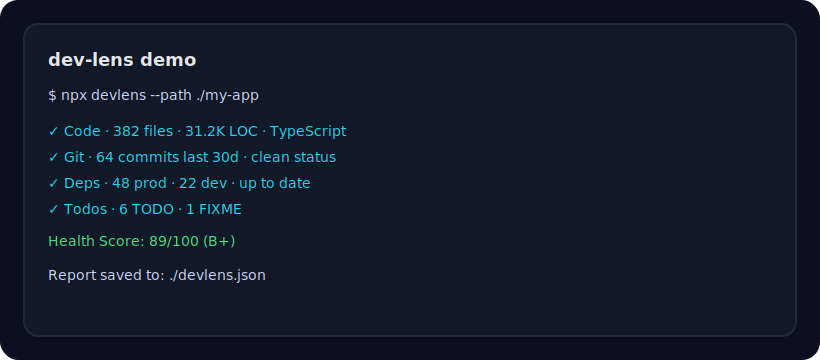

<div align="center">


# dev-lens 🔍

**Zero-config project health analyzer — instant insights for any codebase**

[](https://www.npmjs.com/package/devlens)
[](https://github.com/CHHemant/dev-lens/actions)
[](https://www.npmjs.com/package/devlens)
[](LICENSE)
[](https://nodejs.org)

```bash
npx devlens
```

*No install. No config. Just run it.*

---



</div>

---

## 🎯 Who it's for

- OSS maintainers who want a fast, friendly health check
- Indie hackers and early-stage teams validating project quality
- Engineering leads scanning multiple repos for risk or tech debt

## 💎 Core value

**dev-lens gives you instant, zero-config project health signals so you can decide what to fix, ship, or share next.**

## ✨ Key features

- Zero-config CLI — works in any repo in seconds
- Health score with clear, actionable breakdowns
- Git, dependencies, code, and TODO scans in one run
- JSON output for CI or dashboards

---

## 🧭 What it does

Drop into **any** project directory and get a beautiful, instant health report:

| Category | What you learn |
|---|---|
| 📁 **Code** | File count, lines of code, language breakdown, largest files |
| 🌿 **Git** | Commit velocity, contributors, branch status, last commit |
| 📦 **Dependencies** | Total deps, outdated packages, ecosystem detection |
| 🐛 **Tech Debt** | TODO/FIXME/BUG count, high-priority items, file locations |
| ❤️ **Health Score** | 0–100 weighted score with letter grade |

Works with **Node.js, Python, Rust, Go, Ruby** projects and any Git repo.

---

## 🚀 Getting Started

```bash
# Run on the current directory (no install needed)
npx devlens

# Analyze a specific project
npx devlens --path /path/to/project

# Output as JSON (great for CI pipelines)
npx devlens --json

# Skip specific analyzers
npx devlens --no-git --no-deps

# Install globally for frequent use
npm install -g devlens
devlens
```

---

## 📦 Install

```bash
# npm
npm install -g devlens

# pnpm
pnpm add -g devlens

# yarn
yarn global add devlens
```

---

## 🎛  CLI Options

```
Usage: devlens [options]

Options:
  -p, --path <path>    Project path to analyze (default: current directory)
  --json               Output raw JSON instead of the terminal UI
  --no-git             Skip git history analysis
  --no-deps            Skip dependency analysis
  --no-todos           Skip TODO/FIXME scanning
  --depth <number>     Max directory depth for file scan (default: 10)
  -v, --version        Output current version
  -h, --help           Display help
```

---

## 🔧 Use in CI

Pipe `--json` output into any script or monitoring system:

```yaml
# .github/workflows/health.yml
- name: Project Health Check
  run: |
    npx devlens --json > health.json
    cat health.json | jq '.code.totalLines'
```

---

## 💡 Example Output

```
╭──────────────────────────────────────────────────╮
│                                                  │
│   🔍 dev-lens v1.0.0                              │
│                                                  │
│   Project: my-saas-app                           │
│   Path:    /Users/dev/projects/my-saas-app       │
│   Scanned: 5/1/2026, 10:42:31 AM                 │
│                                                  │
│   Health:    88/100 (B+)                         │
│   ✓ All good                                     │
│                                                  │
╰──────────────────────────────────────────────────╯

  ◆ CODE OVERVIEW

  Files        342
  Lines        28.4K
  Size         1.2 MB
  Primary      TypeScript

  ── Language Breakdown ─────────────────────
  TypeScript        61%  ▓▓▓▓▓▓▓▓▓▓▓▓▓░░░░░░░  186f
  CSS               14%  ▓▓▓░░░░░░░░░░░░░░░░░░   28f
  JSON               9%  ▓▓░░░░░░░░░░░░░░░░░░░   61f
  Markdown           8%  ▓░░░░░░░░░░░░░░░░░░░░    9f
  YAML               5%  ▓░░░░░░░░░░░░░░░░░░░░   14f

  ──────────────────────────────────────────────────

  ◆ GIT HEALTH

  Branch       main
  Status       ✓ clean
  Branches     7
  Commits      1.2K total, 47 last 30d

  ── Last Commit ─────────────────────────────
  a3f72c1  feat: add stripe webhook handler
  by Alice Chen · 2h ago

  ── Top Contributors ────────────────────────
  Alice Chen            ▓▓▓▓▓▓▓▓▓▓▓▓  312
  Bob Smith             ▓▓▓▓▓▓▓░░░░░  201
  Carol White           ▓▓▓▓░░░░░░░░  118

  ──────────────────────────────────────────────────

  ◆ DEPENDENCIES

  Ecosystem    Node.js
  Manager      npm
  Total        64
  Production   41
  Dev          23
  ✓ All packages up to date

  ──────────────────────────────────────────────────

  ◆ TODOS & TECHNICAL DEBT

  Total Items  23

  FIXME      4
  HACK       3
  TODO       14
  NOTE       2

  ── High Priority ───────────────────────────
  FIXME   src/auth/session.js:142
         Race condition in token refresh — needs mutex
  FIXME   src/api/billing.js:88
         Stripe webhook retry not idempotent
```

---

## 🌍 Ecosystem Support

| Ecosystem | File | Deps | Outdated |
|---|---|---|---|
| **Node.js** | `package.json` | ✅ | ✅ (npm outdated) |
| **Python** | `requirements.txt` | ✅ | ❌ |
| **Rust** | `Cargo.toml` | ✅ | ❌ |
| **Go** | `go.mod` | ✅ | ❌ |
| **Ruby** | `Gemfile` | ✅ | ❌ |
| **Any** | — | — | Git + Code always work |

---

## 📣 Launch Plan (Maintainers)

### 2-week goals

- ⭐ 50+ stars from relevant dev communities
- 🧪 10+ users run dev-lens and share feedback
- 🧭 5+ actionable issues opened (bugs, feature requests, or docs)

### 2-week outreach schedule

| Day | Focus | Example post |
|---|---|---|
| 1 | Launch announcement | “Zero-config project health in one command.” |
| 2 | Demo clip | 20–30s recording with a real repo |
| 3 | Lesson learned | What dev-lens surfaced in your own repo |
| 4 | Feature highlight | Git + TODO scan + health score |
| 5 | Use case | “Before a release: run dev-lens” |
| 6 | Community share | Ask for feedback, not stars |
| 7 | Recap | Share improvements + next goals |
| 8 | Progress update | Metrics + new issues fixed |
| 9 | Integration tip | JSON output for CI |
| 10 | Testimonial | Quote or screenshot from a user |
| 11 | Roadmap poll | Ask which feature to build next |
| 12 | Issue spotlight | “Good first issue” share |
| 13 | Behind the scenes | How scoring works |
| 14 | Wrap-up | Results + next milestone |

### Target communities

- r/opensource, r/commandline, r/webdev
- Indie Hackers, dev.to, Hashnode
- Discords/Slack groups for Node.js, OSS, and indie builders

### Engagement loop

- Respond within 24 hours to comments and issues
- Ship small fixes fast and share the update publicly
- Highlight contributors and credit feedback

---

## 🗺 Roadmap

- [ ] HTML/PDF report export
- [ ] `--watch` mode for live updates
- [ ] Outdated dependency check for Python (pip), Rust (cargo), Go
- [ ] GitHub Actions native summary output
- [ ] Historical tracking (compare health over time)
- [ ] Config file (`.devlens.json`) for custom ignore patterns
- [ ] Plugin API for custom analyzers

> **Want a feature?** [Open an issue](https://github.com/CHHemant/dev-lens/issues) or [submit a PR](https://github.com/CHHemant/dev-lens/pulls)!

---

## 🤝 Contributing

Contributions are very welcome! Please see [CONTRIBUTING.md](CONTRIBUTING.md) for guidelines.

Looking for a starter task? Check out issues labeled [good first issue](https://github.com/CHHemant/dev-lens/labels/good%20first%20issue).

```bash
git clone https://github.com/CHHemant/dev-lens.git
cd dev-lens
npm install
npm test
node bin/devlens.js   # run on itself!
```

---

## 📄 License

[MIT](LICENSE) © 2026 Hemant Chilkuri

---

<div align="center">

**If dev-lens saved you time, please ⭐ star the repo — it really helps!**

Made with ❤️ for the developer community

</div>
